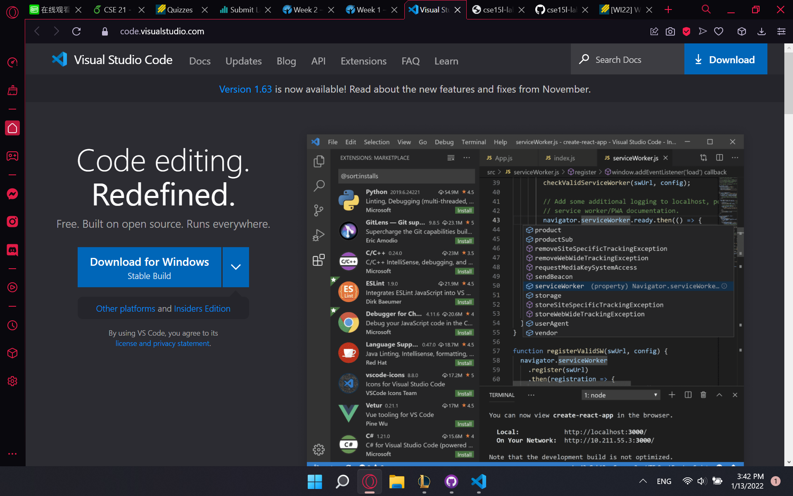
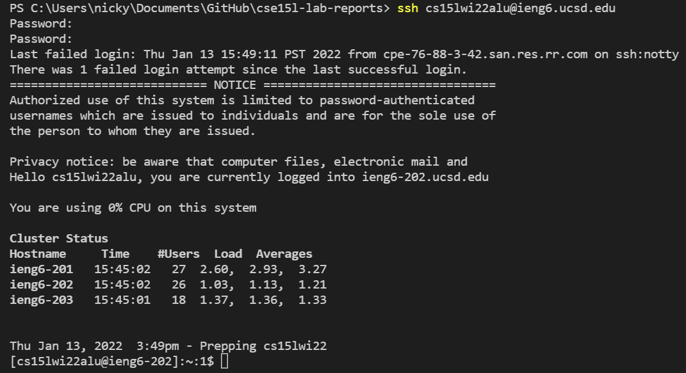
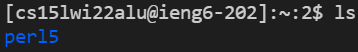
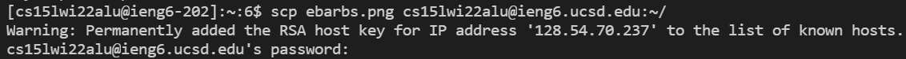
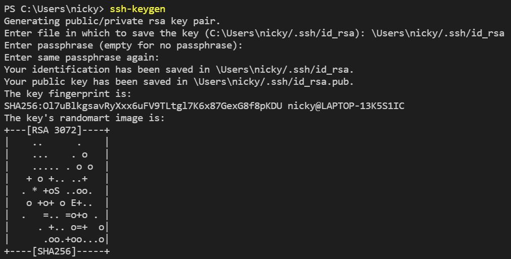
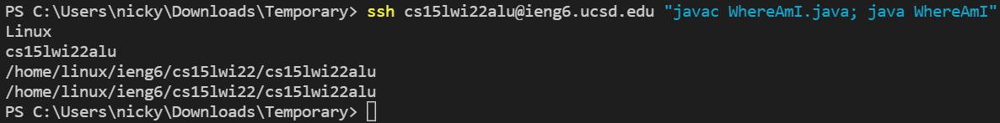

#Remote Access

Hello! My name is Nicholas Dai and I will be writing about how to access course specific accounts on ieng6. 

##Step 1: Download VScode

Download VScode. VScode, or Visual Studio Code, is a text editor / compiler, which is basically a software that allows computer code to compile and run in a certain way. To do so, head over [here](https://code.visualstudio.com) and download for whatever operating system you have. I have Windows, so I downloaded it onto Windows.



##Step 2: Connect Remotely

Look up your CSE15L username [here](https://sdacs.ucsd.edu/~icc/index.php). Click "Terminal", then click "New Terminal", and then type in ```ssh [username for cse15l]@ieng6.ucsd.edu``` and press enter. Then enter your password.



##Step 3: Trying Commands

There are many commands you can run in your terminal for fun on remote connection. Here are are a few you can try: ```cd```, ```ls```. ```cd``` enters a file, while ```ls``` shows what files you have that can be accessed.



##Step 4: Moving Files

```scp``` is a special command that allows you to move files between remote and local destinations. Create a random file in your VScode, and then enter ```scp [file name] [username for cse 15l]@ieng6.ucsd.edu:~/```. You will be prompted to enter your password. Enter it.



##Step 5: Setting an SSH key

Setting an SSH key. Setting an SSH key can make it so that you no longer have to answer your password every time you are prompted to on VScode, or make an easier passcode. At this point, I tried to fix a password problem and I now can no longer log in to SSH once again so I can no longer offer a screenshot for this step. Use this screenshot as proof of this SSH being stupid. However, I will still give instructions. First enter ```ssh-keygen```. You will be prompted to enter a file to save the key, at which point enter a file to save the key. You will be asked what new password you want, aka the key to make entering your password easier. Press enter if you just don't want a password, which is what I did. Next, enter ```[username]@ieng6.ucsd.edu```, enter your password, type ```mkdir .ssh```, and then type ```logout```, and finally type ```scp /Users/[local username]/.ssh/[the file you put your key in].pub [username for cse15l]@ieng6.ucsd.edu:~/.ssh/authorized_keys```. Now you are good to go!




##Step 6: Making remote running easier

There are many ways to make remote running even more pleasant for you. Most of these you can learn on your own by looking it up on StackOverflow or through other documentation, but I will offer an example here. If you type a command in the same line as an ssh command, you can do both and save a lot of time. Here, I type the command ```ssh cs15lwi22alu@ieng6.ucsd.edu "javac WhereAmI.java; java WhereAmI"```. It combines the command of logging in, running the file, and logging out, all into the same one command, thus saving the two keystrokes of pressing extra enters. Two keystrokes is a lot of time man.


