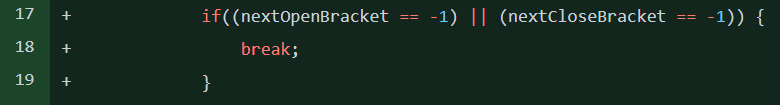
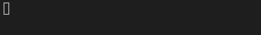
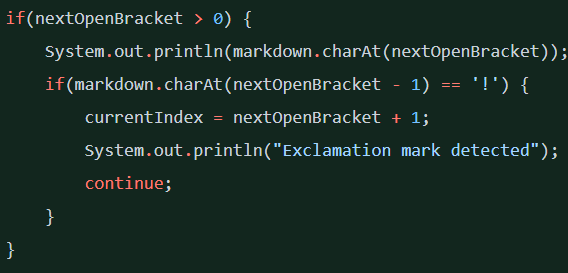
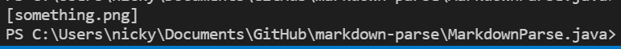
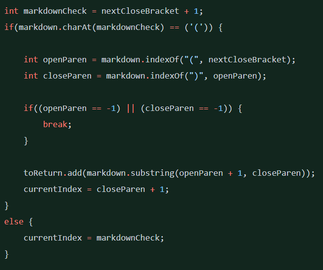
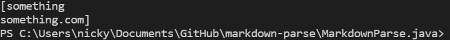

# Week 4 Lab Report: Bug Catching and Fixing Symptoms

Hello! My name is Nicholas Dai and I will be documenting code changes in Github that was used to fix bugs.

## First Change



This code was changed because, when using a test file such as [this one](https://github.com/nicholasdai/cse15l-lab-reports/blob/main/test%20file%201.md). This is because the loop '''while(currentIndex < markdown.length())''' would never close, like have an infinite loop, because '''currentIndex''' would continuously equal 0 since since when '''indexOf''' can't find what it's looking for, it returns -1, which when + 1 = 0, and then the loop is infinite. This problem was solved by adding a break statement when '''nextOpenBracket''' or '''nextCloseBracket''' returned -1 (no next brackets were found), so the loop was artificially broken.



## Second Change



This code was changed because, when using [this](https://github.com/nicholasdai/cse15l-lab-reports/blob/main/test%20file%202.md) or a similar test file, an image would be printed because there is nothing to distinguish images and links since they both have brackets. This code change allows for ```!``` to be checked, in order to see if there would be an image, since images are distinguished from links by the exclamation mark.



## Third Change



This code was changed because, when using [this](https://github.com/nicholasdai/cse15l-lab-reports/blob/main/test%20file%203.md) or a similar test file, we get no link because there is text between the closing bracket and first parenthesis. This is because there is nothing to check for the text in between, so we added code that searches for whether or not the first element after a closing bracket is a parenthesis or just text, and appropriately treates each.


