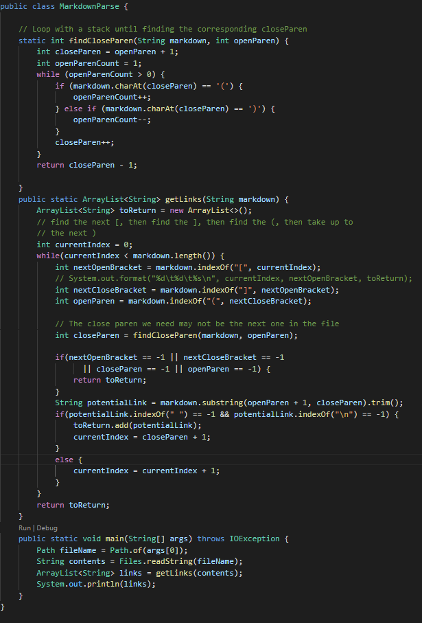
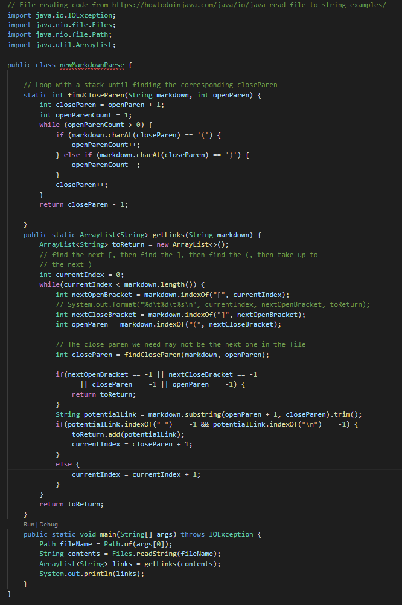
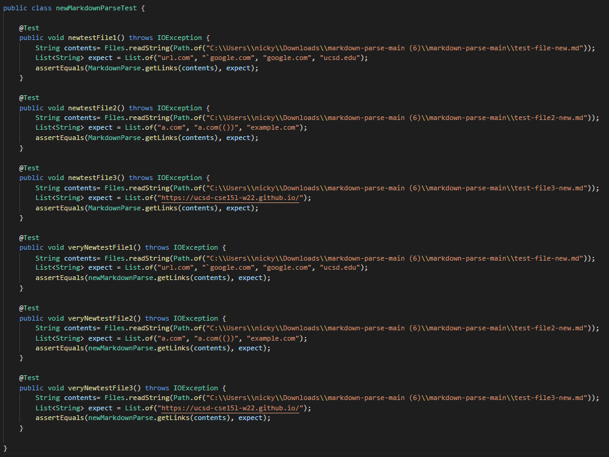
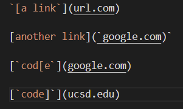
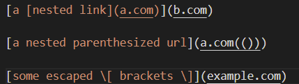
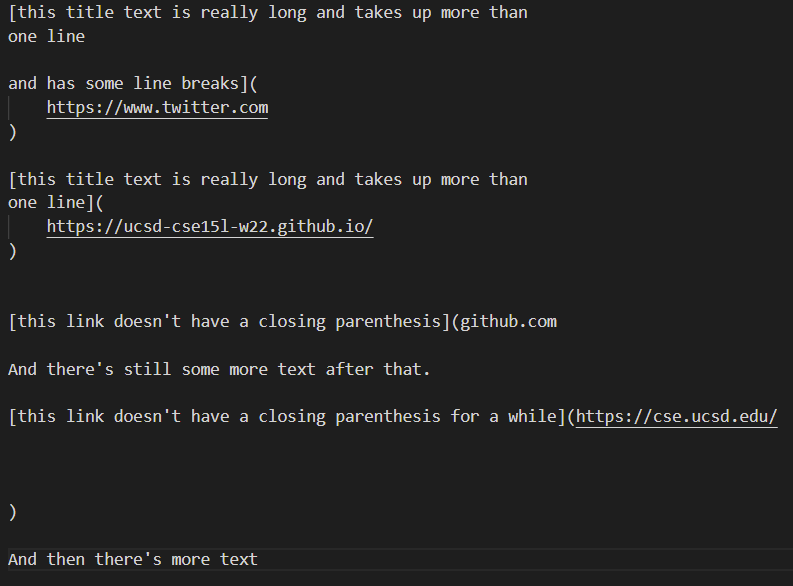
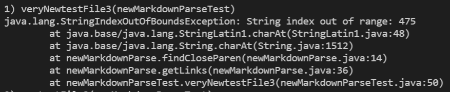
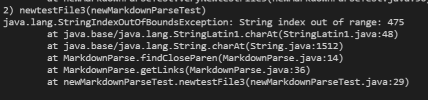

# Week 8 Lab Report: Debugging

Hello! My name is Nicholas Dai today we will be discussing debugging. In the past, we had created a MarkdownParse file to parse for markdown links. Today, we were given another implementation, and tests were run to see how both implementations read the test files given. My implementation can be seen [here](https://github.com/nicholasdai/markdown-parse) and the given implementation is [here](https://github.com/ucsd-cse15l-w22/markdown-parse).

## Implementation of MarkdownParse

Here, for reference sake, the implementation of markdwownparse can be seen, using both my own and the given implementation.

## Tester

Here, the code for the tester run to see if the implementation works is seen here. For reference, the test files are shown below.

## Failing test cases

When the tester is actually run, 4 of the 6 tests pass, with only two that fail. The two that fail both involve snippet 3. There is no code needed to be added to make snippets 1 and 2 work, but for 3, it will take more than just some short code to make it work. Or at least perhaps not with the current methods, since the errors are coming from the file being too long and the code not being able to properly index it.
