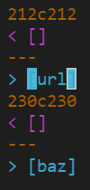
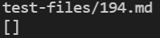
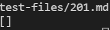
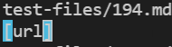
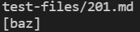
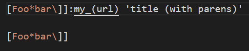
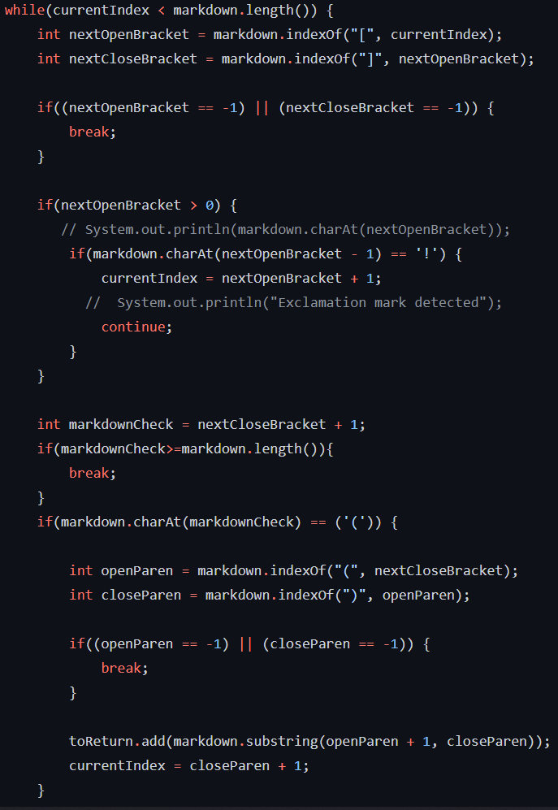
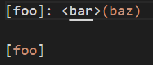
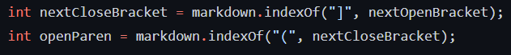

# Week 10 Lab Report: Two Different Implementations

Hello. Today we will be showing how to run many tests at the same time, and how they show the differences between two different implementations.

## Overall Tests

I started off by making sure I copied over the test files between both the given and my own implementation, and the scripts too. To do this, I first entered my remote ieng6 account, cloned the new given implementation, and typed ```cp -r markdown-parse/test-files my-markdown-parse/```. Keep in mind that the first repository is the given one and the second is my own. This copied the tests over. We were given a script too that could run all the tests, but I first editted the script so that it would print the test run next to the result of the test, because so many tests are being run at the same time. This involved me going into the given repository, typing ```vim script.sh```, and then in vim editting the script to add a ```echo $file``` to print the test file name. Finally, I copied over the script to the other repository by typing ```cp markdown-parse/script.sh my-markdown-parse/```. I ran the script on both repositories by entering into each repository respectively and typing ```make``` and then ```bash script.sh > results.txt```. The last part copies over the results of the test run into a txt file. Finally, I ran ```diff my-markdown-parse/results.txt markdown-parse/results.txt > fullresults.txt``` to compare the differences between the results. This led to me to obtain a new file of the differences. Since we are only showing two differences, my image will only show two of the differences.



## Finding the Tests

After analyzing the differences, I see that in lines 212 and 230 of each results file, there is a difference. So I open up those files and look at the differences. For my own implementation, I got:




For the other implementation, I got:




Because I had editted the script originally, I can also see what files led to this, so I opened up both test files. They were tests 194 and 201.

## Failing Test 1

The first file is shown below: 


For this test, the expected output should have been ```[my_(url)]```. As seen in my previous images, I got the following:


This meant that neither implementation was correct. 

The issue with my code was that I spent the whole time searching for parentheses and forgot that there is an alternative implementation which uses a colon. If I add an additional loop to check for it, it would be solved.



## Failing Test 2

The second file is shown below:


For this test, the expected output should have been ```[]```. As seen in my previous images, I got the following:


This meant that my implementation was correct, and the given was wrong.

The issue with the given code was that it did not check for spaces and text between the next close bracket and open paren, because if there is then the link would not be generated correctly.



## Conclusion

Hope you all enjoyed the lab report.
